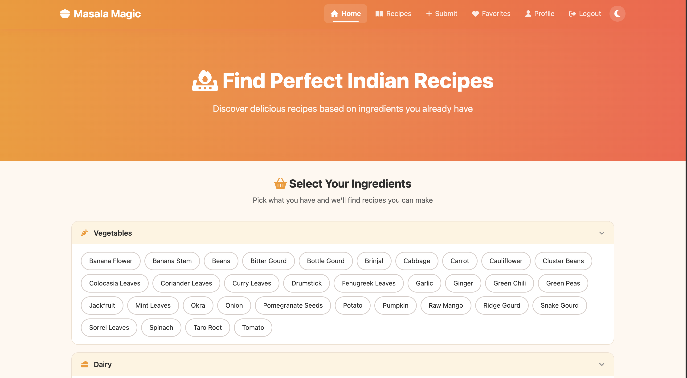
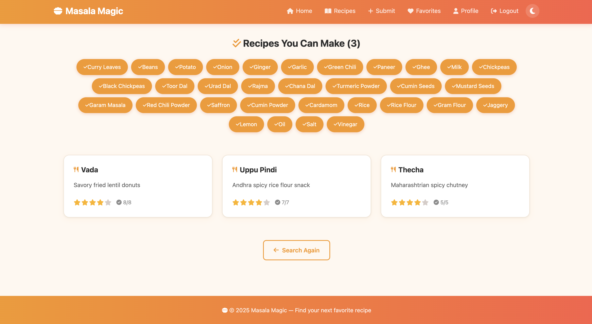
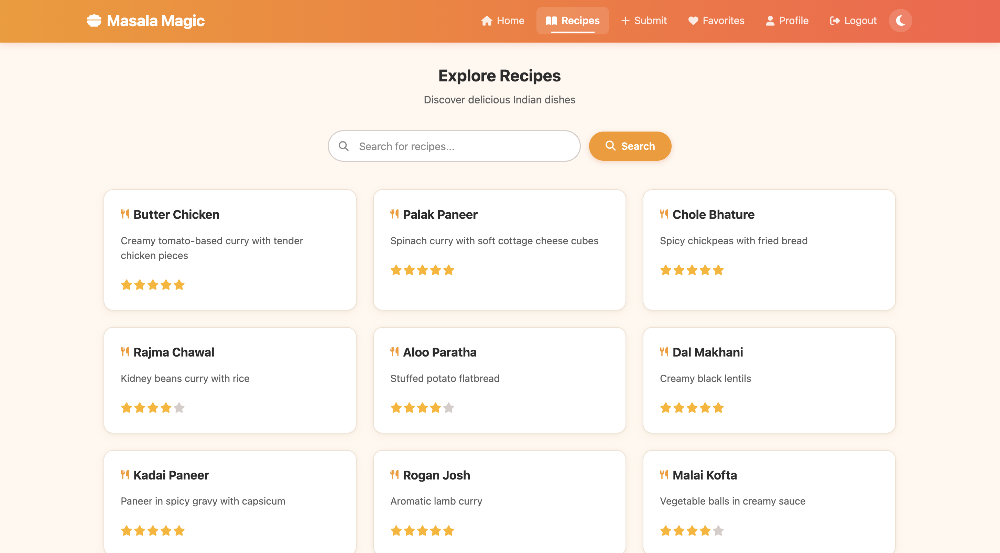
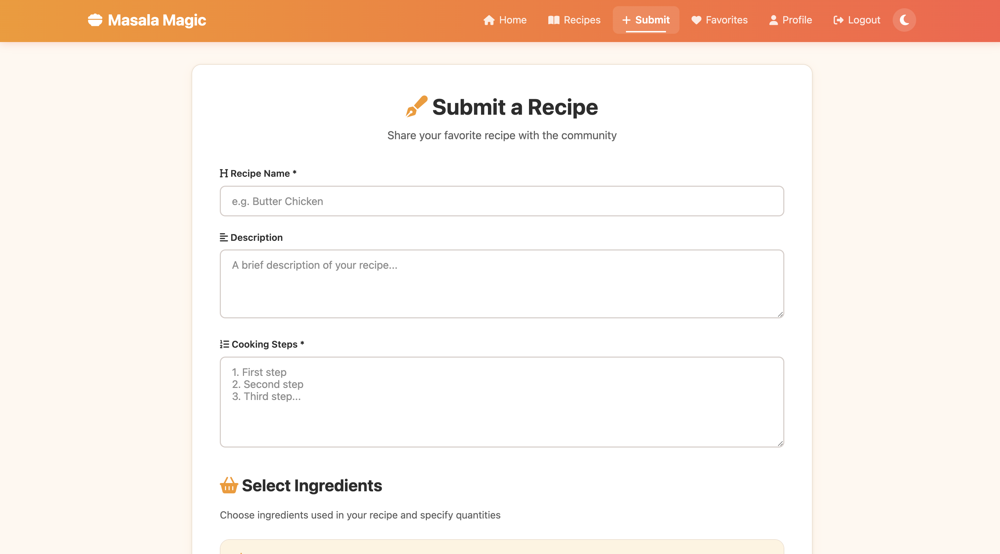

# Masala Magic

A recipe recommendation system that helps you discover Indian recipes based on the ingredients you have. Select what's in your kitchen, and Masala Magic finds recipes you can make right now!

## Features

- **Smart Ingredient Search** — Select ingredients you have, get recipes you can actually make (all recipe ingredients must be in your selection)
- **Submit Recipes** — Share your own recipes with the community
- **Rate Recipes** — Rate recipes 1-5 stars, see community averages
- **Favorites** — Save and manage your favorite recipes
- **Search by Name** — Find recipes by title with text search
- **Pagination** — Browse recipes 12 at a time
- **Similar Recipes** — Discover related recipes on each recipe page
- **Dark / Light Mode** — Toggle between themes (persists across sessions)
- **User Auth** — Signup, login, logout with secure password hashing
- **Profile Management** — Update username/password, delete account
- **Manage Recipes** — Delete recipes you've submitted
- **Responsive Design** — Works on desktop, tablet, and mobile

## Tech Stack

| Layer | Technology |
|-------|-----------|
| Backend | Python, Flask |
| Database | SQLite (zero setup — auto-creates on first run) |
| Frontend | HTML, CSS, Jinja2, Font Awesome icons |
| Auth | Werkzeug password hashing |

## Project Structure

```
Recipe_Recommendation_System/
├── run.py                  # Entry point
├── config.py               # App configuration
├── schema.sql              # Database table definitions
├── seed_data.py            # Auto-seeds 100 ingredients & 72 recipes
├── requirements.txt        # Python dependencies
├── .gitignore
├── app/
│   ├── __init__.py         # App factory, DB setup
│   ├── routes/
│   │   ├── auth.py         # Login, signup, logout
│   │   ├── recipes.py      # Recipe CRUD, search, ratings
│   │   ├── profile.py      # Profile management
│   │   └── favorites.py    # Favorites management
│   ├── templates/          # Jinja2 HTML templates
│   │   ├── base.html       # Base layout (navbar, footer, theme toggle)
│   │   ├── homepage.html   # Ingredient selector + latest recipes
│   │   ├── recipes.html    # Paginated recipe listing
│   │   ├── view_recipe.html # Recipe detail with ratings & similar
│   │   ├── submit.html     # Recipe submission form
│   │   ├── favorites.html  # User's saved recipes
│   │   ├── search_results.html
│   │   ├── login.html
│   │   ├── signup.html
│   │   ├── profile.html
│   │   └── update_profile.html
│   └── static/
│       └── styles.css      # Custom CSS (light/dark themes, responsive)
```

## Setup & Run

### 1. Clone the repository

```bash
git clone https://github.com/marvelcodeX/Recipe_Recommendation_System.git
cd Recipe_Recommendation_System
```

### 2. Create a virtual environment

```bash
python -m venv venv

# Windows
venv\Scripts\activate

# macOS/Linux
source venv/bin/activate
```

### 3. Install dependencies

```bash
pip install -r requirements.txt
```

### 4. Run the app

```bash
python run.py
```

The database is **automatically created and seeded** with 100 ingredients and 72 Indian recipes on first run. No manual setup needed!

Open **http://127.0.0.1:5000** in your browser.

## Database Schema

SQLite database with 7 tables:

| Table | Purpose |
|-------|---------|
| `users` | User accounts with hashed passwords |
| `recipes` | Recipe details (title, description, steps) |
| `ingredients` | 100 ingredients across 6 categories |
| `recipe_ingredients` | Links recipes to ingredients with quantities |
| `ratings` | User ratings (1-5 stars, unique per user+recipe) |
| `favorites` | User favorite recipes |
| `search_logs` | Search history tracking |

## How the Recommendation Works

When you select ingredients, the system finds recipes where **every required ingredient** is within your selected set. This means you'll only see recipes you can actually make with what you have. Results are ranked by recipe complexity (most ingredients first).

## Demo Images

| | |
|---|---|
|  |  |
|  |  |

## License

This project is for educational purposes.
