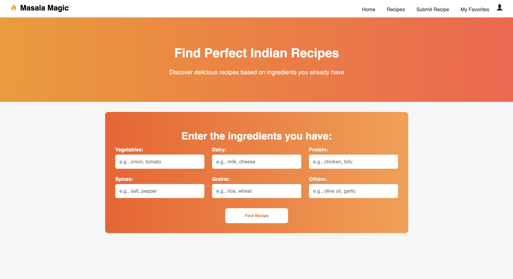

# Masala Magic 🍛

Masala Magic is a web application built using Flask and MySQL that lets users explore, search, rate, and favorite delicious recipes. Whether you're searching based on ingredients or submitting your own creations, this platform makes cooking smarter and more interactive.

---

## 🚀 Features

- 🔍 Ingredient-based recipe search
- 📋 Submit new recipes
- ⭐ Rate recipes (5-star recipes get favorited)
- ❤️ Save and view favorite recipes
- 🔐 User authentication (Sign up, Login, Secure password hashing)
- 📊 Structured database using MySQL
- 🎨 Clean and modern UI with HTML & CSS

---

## 🛠️ Tech Stack

- **Frontend**: HTML, CSS, Jinja2
- **Backend**: Python, Flask
- **Database**: MySQL
- **Authentication**: Flask-Login, Werkzeug (for password hashing)

---

## 🧾 Setup Instructions

### 1. Clone the repository
```bash
git clone https://github.com/yourusername/masala-magic.git
cd masala-magic
```

### 2. Set up the virtual environment
```bash
python3 -m venv venv
source venv/bin/activate
```

### 3. Install dependencies
```bash
pip install -r requirements.txt
```

### 4. Set up the MySQL database
- Create a database named `masala_magic`.
- Run the SQL script:
```bash
mysql -u root -p masala_magic < database.sql
```

### 5. Run the Flask app
```bash
python app.py
```

---

## 🔐 Security Notes

- Passwords are securely hashed using Werkzeug before storing.
- Input validation and basic form handling are included.

---

## 🧠 Future Improvements

- Add images to recipes
- Implement recipe categories
- Add support for multilingual ingredients
- Enhance UI with JavaScript interactions

---

## 🖼️ Preview


